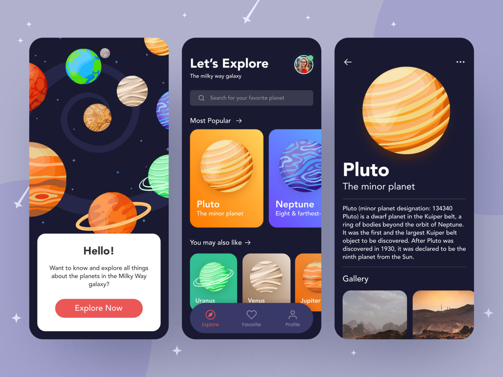

# Vision Planets API

Koa Node Server for the future mobile app Planets Vision

To start the project you should:

1. install node >=14.0.0
2. add config to `.env` with content
3. run `npm install`
4. run `npm run dev`

## Project Commands

1. run `dev` - start server with dev mode
2. run `init` - init typescript config file
3. run `tslint` - linting ts files
4. run `start` - start production ready server
5. run `prettier:*` - run prettier for {ts,tsx} files

## Project structure

We use [Agility](https://agilitycms.com/) as a headless CMS to store planets data.
For implementing new features basically need to work with api `bridge` to agility.
